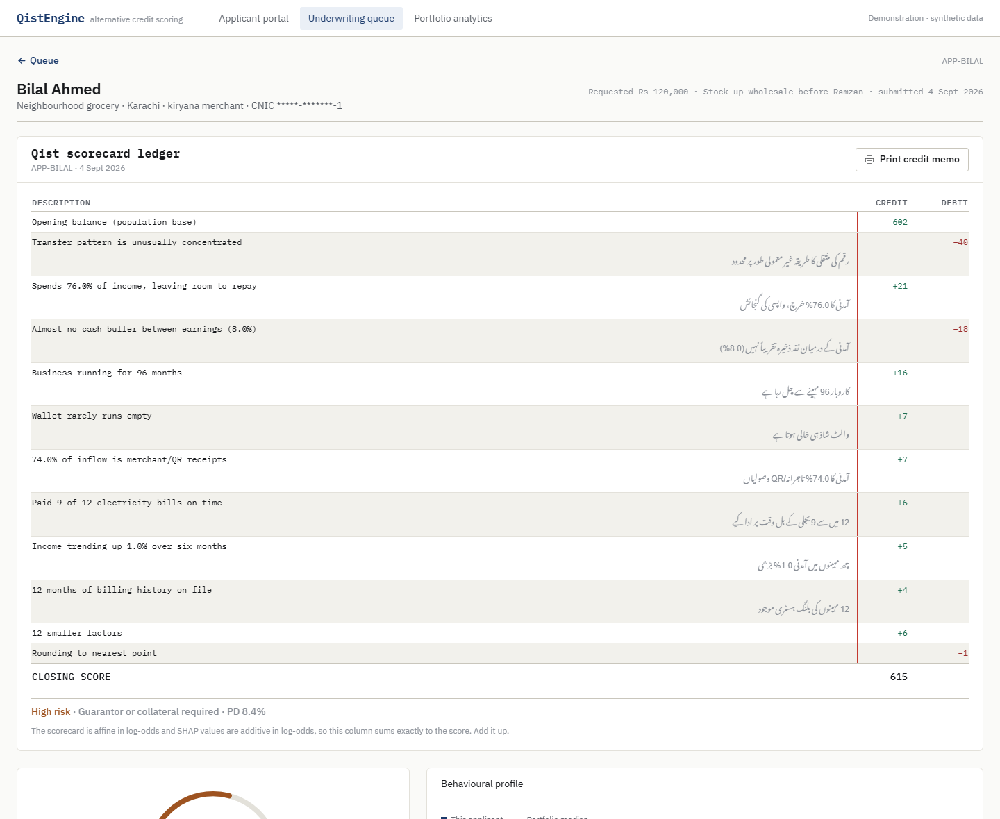
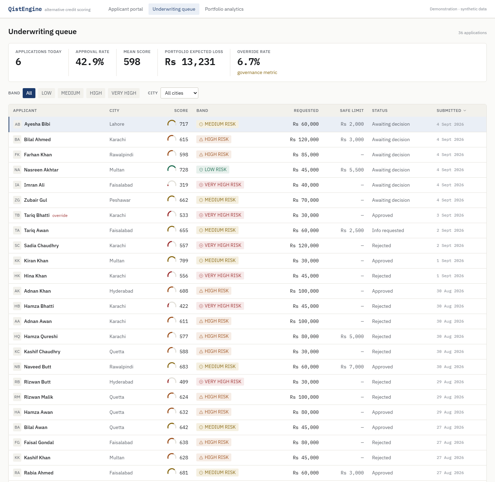
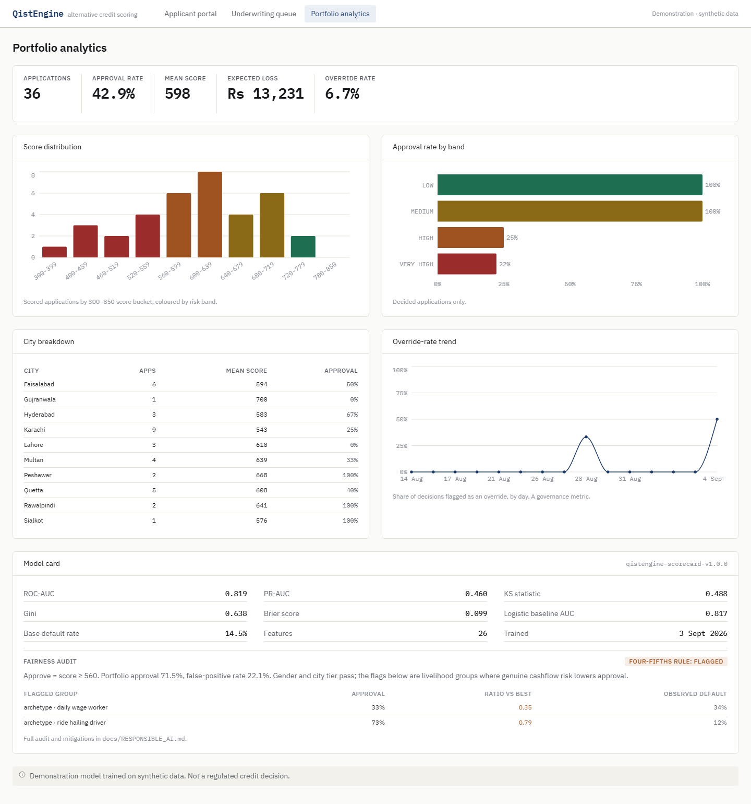
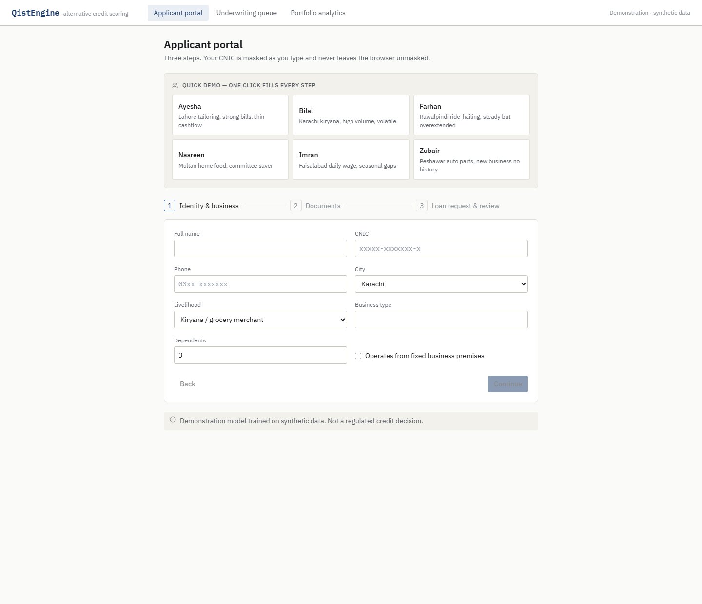

# QistEngine

**Alternative credit scoring for unbanked individuals and micro-merchants in
Pakistan.** One electricity bill and one mobile-wallet transaction log become a
300–850 score, a calibrated probability of default, an exact reason-code ledger,
and a safe monthly installment ("Qist") offer.

> **Demonstration model trained on synthetic data. Not a regulated credit
> decision.** Fairness by construction: gender, religion, ethnicity, caste and
> marital status are never model features.

---

## ▶ Run it (two commands)

**Needs:** Python 3.10–3.12 (not 3.13), Node 20 LTS, and `bash`
(macOS/Linux have it; on Windows use **WSL2** or **Git Bash**).

```bash
git clone https://github.com/sohjpeg/qistengine.git
cd qistengine
bash run-dev.sh
```

`run-dev.sh` sets everything up on the first run (~4 min: Python venv, synthetic
data, model training, npm install) and then starts both servers. When you see
**`QistEngine is running`**, open:

### → http://localhost:3000

Click a **Quick Demo** profile on the applicant portal, submit, and you land on
the scored applicant page. `Ctrl-C` in the terminal stops everything. After the
first run it's offline — no internet needed.

<details><summary>Prefer to do it in steps, or hit an error?</summary>

```bash
bash bootstrap.sh    # one-time setup only
bash run-dev.sh       # start the app
```

See **Troubleshooting** near the bottom (ports in use, wrong Python, Tesseract,
numpy, etc.).
</details>



---

```
┌───────── Applicant portal ─────────┐   ┌──────── Underwriting console ────────┐
│  upload bill + wallet log          │   │  queue · KPIs · filters             │
│  OCR + parser → editable fields    │──▶│  score ledger (khata) · Qist limit  │
│  loan request → submit             │   │  behaviour radar · decision + audit │
└────────────────────────────────────┘   └─────────────────────────────────────┘
                     │                                    │
                     ▼               FastAPI :8000        ▼
         calibrated LightGBM scorecard · SHAP · SQLite persistence
```

---

## The problem

Around **100 million adults in Pakistan** sit outside the formal banking system.
Traditional bureau scoring needs a repayment history that unbanked merchants and
daily-wage earners were structurally never allowed to build. A kiryana shopkeeper
with twelve years of trading and a mobile wallet still has a blank credit file.

QistEngine scores the data they *do* generate — utility-payment discipline and
wallet cashflow behaviour — with 26 features, every one derivable from a utility
bill and a transaction log.

---

## How it works

1. **Ingest.** `parse-bill` reads a utility bill (pdfplumber text layer →
   Tesseract → deterministic simulated fallback, always labelled). `parse-transactions`
   normalises any wallet export — JazzCash, EasyPaisa, SadaPay, NayaPay, or a
   hand-kept Digital Khata ledger — with a tolerant column map and an
   Urdu-and-English keyword classifier.
2. **Feature engineering.** 26 frozen features across utility discipline,
   cashflow health, transaction behaviour and stability. Partial data is imputed
   at population medians and reported in a `data_gaps` array — scoring never
   fails.
3. **Score.** A `StandardScaler` + calibrated LightGBM scorecard. The 300–850
   score uses points-to-double-the-odds scaling (PDO 40, base 660, base odds 30);
   the displayed probability of default is isotonic-calibrated.
4. **Explain & decide.** Per-feature SHAP values convert to score points
   *exactly* (`points = −factor · shap`), rendered as a khata ledger that sums to
   the score. A safe Qist installment is derived from disposable income through a
   transparent haircut waterfall. Non-approvals carry adverse-action codes.
5. **Stress-test.** A **what-if panel** lets the officer drag four levers
   (income, utility discipline, volatility, expense burden) and watch the score,
   band, probability of default and Qist offer re-compute live — the model is
   examinable, not a black box.

The ledger genuinely foots to the score — SHAP values are additive in log-odds
and the score is affine in log-odds, so `sum(points) + base = score` exactly.

| Underwriting queue | Portfolio analytics |
|---|---|
|  |  |
| **Applicant portal** | **What-if analysis** (bottom of the detail page) |
|  | see the full detail page → [`detail-full.png`](docs/screenshots/detail-full.png) |

---

## Setup notes

- **`bash run-dev.sh` is all you need.** It runs `bootstrap.sh` itself the first
  time. After that, `run-dev.sh` just starts the two servers.
- The app is **fully offline after the first run** — no CDN, no remote datasets,
  no LLM calls. Fonts and demo data are bundled.
- **Windows:** use **WSL2** or **Git Bash** (ships with Git for Windows). Clone to
  a short path like `~/qistengine` — a very deep path can trip Windows' 260-char
  limit on the LightGBM DLL.
- **Determinism:** every RNG is seeded with 42. Two training runs produce
  byte-identical metrics.

## Manual setup (only if `bootstrap.sh` fails partway)

```bash
# backend
cd backend
python3.11 -m venv .venv
source .venv/bin/activate            # Windows: .venv/Scripts/activate
pip install -r requirements.txt
python scripts/generate_synthetic_data.py --n 5000 --seed 42
python scripts/train_model.py
python scripts/fairness_audit.py
python scripts/make_sample_files.py
python scripts/export_demo_cache.py
python -m app.seed
cp .env.example .env
uvicorn app.main:app --reload --port 8000

# frontend (second terminal)
cd frontend
cp .env.local.example .env.local
npm install
npm run dev
```

> Don't run `npm run build` while `npm run dev` is running in the same folder —
> it corrupts `.next`. If dev starts throwing 500s: `rm -rf frontend/.next` and
> restart.

---

## API reference

All routes under `/api/v1`. Interactive docs at `/docs`.

| Method | Path | Purpose |
|--------|------|---------|
| GET | `/health` | Liveness + model version and load status |
| POST | `/api/v1/score` | Score a payload of raw signals or pre-extracted features |
| POST | `/api/v1/parse-bill` | Multipart upload → extracted bill fields |
| POST | `/api/v1/parse-transactions` | Multipart CSV/JSON → normalised ledger + aggregates |
| POST | `/api/v1/applications` | Create application, score, persist, return full result |
| GET | `/api/v1/applications` | Paginated list; filter by status / risk_band / city; sort by score / date |
| GET | `/api/v1/applications/{id}` | Full detail: documents, features, reasons, monthly series |
| PATCH | `/api/v1/applications/{id}/decision` | Record approve/reject; sets `override_flag` |
| GET | `/api/v1/metrics` | Portfolio KPIs for the analytics page |
| GET | `/api/v1/mock/profiles` | Six ready-made demo profiles for one-click loading |
| GET | `/api/v1/model/info` | Feature list, metrics, version, training date |
| GET | `/api/v1/samples/{filename}` | Download a demo bill / ledger |

---

## Model performance

From the shipped training run (`qistengine-scorecard-v1.0.0`, seed 42, n = 5000,
held-out test split of 750):

| Metric | Value |
|--------|-------|
| ROC-AUC (calibrated) | **0.819** |
| ROC-AUC (uncalibrated) | 0.828 |
| PR-AUC | 0.460 |
| KS statistic | 0.488 |
| Gini | 0.638 |
| Brier score | 0.099 |
| Logistic baseline ROC-AUC | 0.817 |
| Base default rate | 0.145 |

`train_model.py` asserts test ROC-AUC ≥ 0.78 and refuses to ship otherwise. Two
runs produce byte-identical metrics. Full derivation in
[`docs/SCORING_METHODOLOGY.md`](docs/SCORING_METHODOLOGY.md).

### The six demo profiles

| Profile | Story | Score | Band | Qist installment |
|---------|-------|-------|------|------------------|
| Nasreen | Multan home food, committee saver | 728 | LOW | Rs 5,500 |
| Ayesha | Lahore tailoring, strong bills, thin cashflow | 717 | MEDIUM | Rs 2,000 |
| Zubair | Peshawar auto parts, new business, no history | 662 | MEDIUM | not eligible (thin data) |
| Bilal | Karachi kiryana, high volume, volatile | 615 | HIGH | Rs 3,000 |
| Farhan | Rawalpindi ride-hailing, steady but overextended | 598 | HIGH | not eligible |
| Imran | Faisalabad daily wage, seasonal gaps | 319 | VERY_HIGH | not eligible |

---

## Project structure

```
qistengine/
├── bootstrap.sh · run-dev.sh
├── docs/           ARCHITECTURE · SCORING_METHODOLOGY · DEMO_SCRIPT · DESIGN_SYSTEM · RESPONSIBLE_AI
├── backend/
│   ├── app/
│   │   ├── routers/       health · scoring · ingestion · applications · metrics
│   │   ├── services/      feature_engineering · scorecard · qist_limit · explainer · ocr
│   │   │                  transaction_parser · pipeline · mock_profiles
│   │   └── ml/            registry.py + artifacts/ (model.pkl, scaler.pkl, explainer.pkl, metadata.json)
│   ├── scripts/           generate_synthetic_data · train_model · fairness_audit · make_sample_files · export_demo_cache
│   ├── data/samples/      6 demo bills + 6 demo ledgers
│   └── tests/             test_features · test_scorecard · test_qist_limit · test_api
└── frontend/
    └── src/
        ├── app/           / · /apply · /dashboard · /dashboard/[id] · /analytics
        ├── components/    ScoreLedger (signature) · ScoreGauge · BehaviorRadar · QistLimitCard · …
        └── lib/           api.ts · types.ts · format.ts · chartTheme.ts · mockProfiles.ts
```

---

## Troubleshooting

| Symptom | Fix |
|---------|-----|
| **Port 8000 / 3000 already in use** | `lsof -ti:8000 \| xargs kill` (or `:3000`), then re-run. |
| **`TESSERACT_MISSING`** | Expected. Image bills fall back to a labelled simulated extraction. Do not install Tesseract. |
| **numpy ABI / `_ARRAY_API not found`** | A stray numpy 2.x is installed. `pip install "numpy==1.26.4"` inside `backend/.venv`. |
| **`Model artifacts not loaded`** on `/health` | Run `cd backend && python scripts/train_model.py`. |
| **CORS error in the browser console** | `QIST_CORS_ORIGINS` must include `http://localhost:3000` (it does by default). |
| **Frontend build: `_mock_data.json` missing** | `cd backend && python scripts/export_demo_cache.py`. |
| **`run-dev.sh` prints garbled colours** | Run the backend and frontend in two separate terminals (see Manual setup below). |

---

## Responsible AI

Full audit with measured numbers in
[`docs/RESPONSIBLE_AI.md`](docs/RESPONSIBLE_AI.md), regenerated by
`scripts/fairness_audit.py`.

- **Forbidden features:** gender, religion, ethnicity, caste, marital status, and
  area-level proxies. They exist in the synthetic dataset only so the audit can
  measure disparate impact against them.
- **Load-shedding protection:** months of anomalously low electricity use are
  flagged and excluded from features — an applicant is never penalised for grid
  failures.
- **Four-fifths rule:** gender and city tier pass; `daily_wage_worker` and
  `ride_hailing_driver` are flagged for disparate impact driven by genuine
  cashflow risk, with documented mitigations (livelihood-specific thresholds,
  guarantor tiers, stepped limits, financial-literacy referrals).
- **Every decision surface** carries the demonstration disclaimer.

---

## Limitations

- Synthetic data validates the pipeline, not real-world outcomes. No pilot book,
  no reject-inference, no back-testing against realised defaults.
- The scorecard scale is anchored to prime odds (30:1 at 660); applied to a 14.5%
  synthetic portfolio, most profiles land HIGH / VERY_HIGH.
- OCR handles common DISCO bill layouts; unusual formats fall back to simulated.
- Single-node SQLite, no auth, no rate limiting — it is a prototype.

## Roadmap

- Consented data pulls via Raast, 1LINK bill histories, and wallet-partner APIs.
- Reject-inference and champion/challenger on a real pilot book.
- Per-product score thresholds and a guarantor-backed product tier.
- Continuous bias monitoring on every model version.
- Urdu-first applicant flow with the RTL toggle promoted to default in-market.
